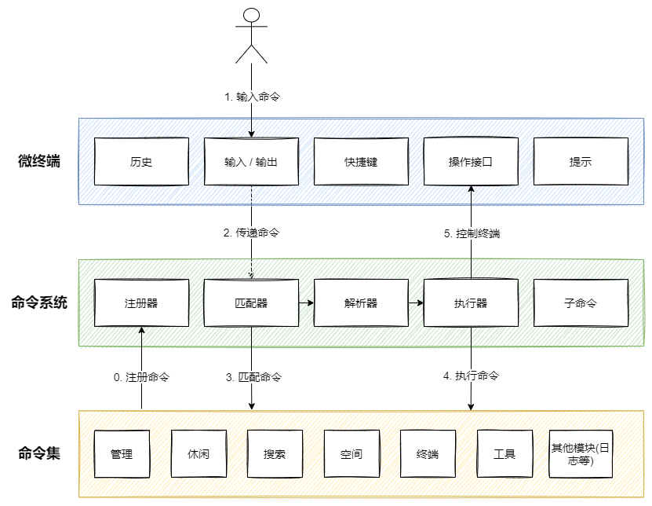

# CmdTerminal - 极客范儿的浏览器主页

> Coolest browser term for geeks! 
> 
> 项目来源 [YuIndex](https://github.com/liyupi/yuindex)
> 
> 在鱼皮YuIndex开源项目的基础上，添加了个人定制化的功能，且将后端重新用cpp实现。

## CmdTerminal 是什么？

一个极客范儿的浏览器主页，支持以命令行方式来操作，可以让开发者在一个 web 终端中高效完成所有的事情！

此外，它也是一个功能强大的 web 终端组件。开发者可以在它的基础上定制自己的 web 终端，并且可以在终端中集成任何内容！例如，角色权限控制、日志管理、命令集展示、博客推荐等。

项目界面展示 ⭐️ 


## 快速上手

### 前端

1. 下载项目:

```
git clone git@github.com:klc407073648/cpp-notes.git
```

2. 进入项目路径, 安装依赖: 

```
cd ./frontend
yarn install
```

3. 构建内容: 

```
vite build
```

4. 部署: 将docs下的文件copy至nginx服务器即可

### 后端

操作流程如下:
```
# 拉取drogon镜像
docker pull docker.io/drogonframework/drogon

# 启动容器
docker run -it -d -p 8082:8082 -v /home/cmd-terminal/cpp-backend:/home/cmd-terminal/cpp-backend --name drogon_test docker.io/drogonframework/drogon /bin/bash

# 编译源码
docker exec -it drogon_test bash
cd /home/cmd-terminal/cpp-backend/build
cmake ..
make

# 运行
./cmdterminal
```

### 使用

然后在网站内依次输入以下命令：

```bash
baidu 今日热点
github cmd-terminal
weather 南京
todo
按键 Ctrl + O 触发折叠, 再按可展开
history
按键 Ctrl + L 清屏
```

使用  `help 命令英文名` 可以查询某命令的具体用法，如：`help search` 。


使用 `shortcut` 可以查看所有的快捷键。


## 项目优势

### 用户

- 无需鼠标，即可快速完成操作（比如从不同平台搜索内容）
- 极简炫酷，极客范儿，Linux 的味道儿~
- 支持快捷键、帮助和输入提示，降低使用成本
- 支持定制背景等，打造你的个性主页
- 帮助你熟悉 Linux 命令，感受到编程的乐趣

### 开发者

- 可以独立使用功能丰富的 web 终端组件，或二次开发
- 可以开发自己的命令并接入系统

### 学习者

- 可以学到 web 终端的开发方式
- 可以学到系统设计知识，理解抽象和复用
- 可以学到较为规范的代码目录和格式

## 亮点

1. 通过composition API，因为所有的方法都是引入的，可以将单独某个逻辑进行封装。
  * 采用Vue3 Compostion API向微终端提供历史命令、提示、快捷键等功能，使得系统更易维护

2. 采用注册机制来维护命令集

3. 使用 Pinia 全局管理器，实现多组件复用变量以及LocalStorage 自动持久化

  * Pinia 是 Vue 的存储库，它允许您跨组件/页面共享状态。
  * Store
    - 三个概念，state、getters 和 actions 等同于组件中的“数据”、“计算”和“方法”
    - 在整个应用程序中访问的数据，可以使用Store进行托管
    - 与Vuex比较，更轻量，易学

4. 为了防止频繁输入提示影响页面的性能， 使用 Lodash 库的防抖功能，减少用户输入的卡顿感

5. 仿 Linux 命令自实现文件系统，封装为空间命令，可以像管理文件一样管理已收藏的网站

## 功能和特性

### web 终端

- 命令历史记录、快速执行历史命令
- 快捷键
- 清屏
- 命令输入提示
- Tab 键补全命令
- 多种格式输出
- 内置 5 种输出状态
- 命令折叠 / 展开
- 帮助手册自动生成
- 自定义配置（比如更换背景、提示开关等）
- 支持子命令

### 已支持命令

> **完整命令用法**请见：[命令手册](./doc/commands.md)

- 多平台搜索    search
- 天气          weather
- 查看日期      date
- 翻译          fanyi
- 待办事项      todo
- 网络检测      ping
- 定时器        timing
- 更换背景      background
- 博客推荐      blog
- 其他

## 技术栈

### 前端

主要技术：

- Vue 3
- Vite 2
- Ant Design Vue 3 组件库
- Pinia 2 状态管理
- TypeScript 类型控制
- Eslint 代码规范控制
- Prettier 美化代码

依赖库：

- axios 网络请求
- dayjs 时间处理
- lodash 工具库
- getopts 命令参数解析

[点击了解前端详情](doc/frontend.md)

### 后端

主要技术：

- Drogon(c++ Web应用框架,内嵌orm框架)
- MySQL
- Redis

依赖服务：

- 百度翻译API
- 搏天API(随机背景)
- 高德天气API

[点击了解后端详情](doc/backend.md)

## 系统设计

### 设计理念

1. 开放：采用类插件化设计，便于开发者自定义新命令，且能够通过配置自动生成帮助提示
2. 重前端轻后端：考虑到扩展性、安全性以及实现的方便，除了核心模块外，尽量不请求后端

### 前端

#### 核心

系统分为 3 个核心模块，各模块职责分明：

- 微终端：UI 展示和终端交互逻辑
- 命令系统：连接微终端和命令集（中介者），负责匹配、解析和执行命令，并通过终端提供的操作接口给予其反馈
- 命令集：各种不同功能的命令定义和实现

前端架构图：



#### 微终端

从 0 开始实现的 web 终端控制台，包含以下模块：

- 终端输入：常驻 Input 框，负责接收用户命令
- 终端输出：负责展示用户的命令及执行结果等，支持以下三种类型的输出
  - 命令类型：输入命令 + 结果列表
  - 文本类型：单行文本展示，内置 5 种不同的展示状态（成功、错误、警告、信息、系统等）
  - 自定义组件类型：可以自由定制要展示的内容
- 快捷键：更方便地操作终端，使用 `document.onkeydown` 全局按键事件实现
- 开放接口：提供一组操作终端的 API，供命令系统调用，比如清屏、立即输出等
- 命令历史：记录用户输入的命令结果，使用 Vue 3 Composition API 封装部分逻辑
- 命令提示：根据用户的输入给出提示，使用 Vue 3 Composition API 独立封装

#### 命令系统

一套独立于终端的命令解析执行引擎，包含以下模块：

- 注册器：用于注册和管理可被匹配的命令集
- 匹配器：根据输入文本匹配到对应的命令
- 解析器：从输入文本中解析出参数和选项
- 执行器：执行命令，完成操作
- 子命令机制：支持递归解析子命令

#### 命令集

一组可用命令的集合（类似插件），通过 TS 明确命令的定义，支持配置别名、选项、子命令等，便于开发者扩展和定制。

核心命令包括：

- 管理：用户、权限等管理
- 休闲：音乐、博客、blibli浏览
- 搜索：支持从不同搜索引擎检索内容(baidu,bing,zhihu,github)
- 空间：自实现的类文件系统，可以管理网页链接等内容
- 终端：定制或控制终端，比如更换背景、输出帮助、清屏、查看历史命令等
- 工具：待处理事项、时间显示、天气查询、翻译内容。
- 其他模块。。。

#### 开发新命令

1. 在 commands 下新建目录，目录名称为命令英文名称，所有该命令相关的代码都必须放在该目录中
2. 编写命令定义文件 xxxCommand.ts（xxx 为命令英文名称），可以参考其他命令，如 music、goto 等
3. 若命令包含子命令，需要将子命令相关文件放到 subCommands 目录中，可以参考 user 命令
4. 在 commandRegister 的 commandList 中补充新命令

### 后端

#### 核心

利用 Drogon 的C++ Web开发框架，实现MVC风格的代码格式。

* M层: 采用Drogon自带的orm框架，连接数据库自动生成models文件
* C层: 使用 Controller 风格，可以直接设置请求路径对应的处理函数的映射关系。
	* 提供统一的过滤器处理
	* http请求前置处理

#### 服务实现

目前后端主要实现四块功能: 用户、第三方接口、日志、缓存等。

1. UserService
	* 用户注册、登录、注销

2. InterfaceService
	* 第三方接口
		- 百度翻译API
		- 搏天API(随机背景)
		- 高德天气API

3. LogService
	* 针对前端已经登录的用户，记录用户的操作日志

4. CacheService
	* 缓存服务	
		* 可以使用本地缓存和redis缓存两种，用枚举区分,  后期考虑定时更新,数据库和缓存同步，Redis待实现
		* 目前作用: 后端启动时加载第三方接口数据库中相关数据，后续调用InterfaceService时，不需要每次都去查询(第三方接口变动不大)
